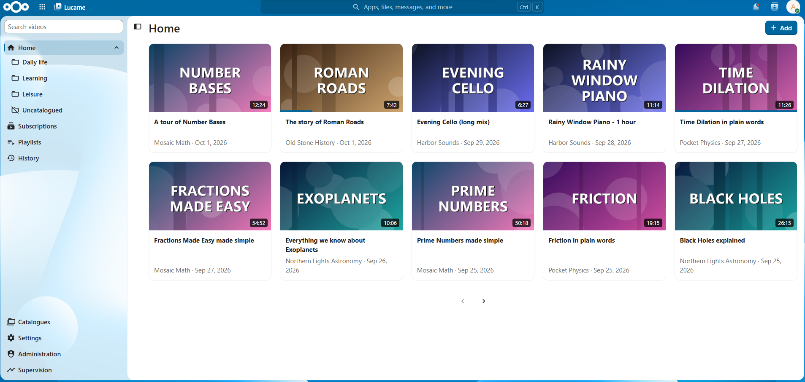
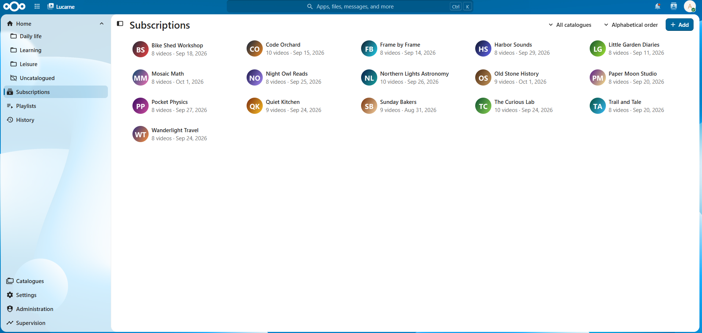

🇬🇧 **English** | [🇫🇷 Français](docs/translations/README.fr.md)

# Lucarne

Lucarne is a focused, private YouTube library for Nextcloud. It follows channels, imports playlists, organizes subscriptions into catalogues, and plays media from a calm interface without requiring a YouTube account.

Lucarne is a Nextcloud AppAPI external application. Its API, catalogue agent, media downloader, database, and web interface run in one container. AppAPI provides an isolated persistent volume for the SQLite database, cached images, temporary downloads, and retained media.





## Requirements

- Nextcloud 35 or 36
- AppAPI with a working HaRP deploy daemon
- A host supported by AppAPI container deployment

## Installation

Register the latest release (v1.3.1) with AppAPI, using the `appinfo/info.xml` of its tag. Replace `<daemon>` with the name of your HaRP deploy daemon:

```sh
php occ app_api:app:register lucarne <daemon> --info-xml https://raw.githubusercontent.com/RomainDel59/lucarne/v1.3.1/appinfo/info.xml --wait-finish
```

AppAPI then pulls and starts the matching container image automatically.

Once installed, an administrator should open Lucarne once. The language of the YouTube titles and descriptions is a single instance setting: it is initialized from the Nextcloud language of the first administrator and can be changed in Administration (English or French). Until it is initialized, English is used.

The image contains Python, FastAPI, `yt-dlp` with its EJS challenge solver, Deno, FFmpeg, the compiled web interface, and the HaRP FRP client. No extra worker container or database is required.


## Features

- Chronological video pages showing two complete rows per page, with icon-only previous and next buttons
- Channel subscriptions and YouTube or personal playlists, in paginated grids that can be sorted and filtered
- Alphabetical catalogues and an automatic uncatalogued view; drag a subscription onto a catalogue of the navigation to add it, or onto the removal zone to take it out of the catalogue being viewed
- Personal playlists in the order you choose: drag videos onto a playlist of the navigation to add them, and drag a tile before or after another to reorder them. Playlists imported from YouTube keep the order of YouTube
- Link to open any channel, video or imported playlist on YouTube
- Per-user playback quality (video up to 1080p, audio from 64 to 256 kbps), audio mode, history depth, and catalogue membership
- Immediate download-and-play with HTTP range support
- Sliding temporary-media retention and optional offline retention
- Persistent, rate-conscious catalogue campaigns and visible batch supervision
- Interface built with Nextcloud components, following the light, dark, or custom theme of each user
- Interface language and date formats follow each user's Nextcloud settings; the language of YouTube titles and descriptions is an administrator setting
- English source language and bundled French localization
- Multi-user isolation from the first stored record

## Data layout

AppAPI exposes the application volume through `APP_PERSISTENT_STORAGE`. Lucarne creates:

```text
lucarne.db
channel-images/
playlist-images/
thumbnails/
downloads/
library/
```

Back up the AppAPI volume with the same policy used for other application data. The container image itself is disposable.

## Contributing

The development setup, checks, local Nextcloud environment, and the steps to add a language are described in [CONTRIBUTING.md](CONTRIBUTING.md).

## Security model

- AppAPI authenticates every API, media, script, style, and image request.
- Every user-owned database query includes the Nextcloud user ID.
- YouTube input URLs are normalized and restricted to approved HTTPS hosts and paths.
- Remote images are restricted to public YouTube image hosts and bounded in size.
- Media paths are generated by Lucarne and never accepted from the client.
- Administrative routes are declared with AppAPI's `ADMIN` access level.

Please report security issues according to [SECURITY.md](SECURITY.md).

## Third-party services

The Lucarne server contacts YouTube to read channel, playlist, and video information and to fetch the media you play, and it downloads images from YouTube's public image hosts. Lucarne includes no analytics, advertisements, or tracking, and does not require a YouTube account.

Your use of YouTube remains subject to its terms of service, and you are responsible for complying with them and with copyright law. Lucarne is not affiliated with or endorsed by YouTube or Nextcloud.

## License

Lucarne is licensed under the GNU Affero General Public License, version 3 or later.
